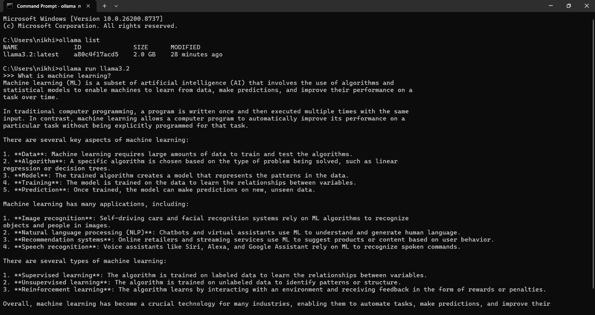

# Experiment 1 — Running the First Program on a Local LLM

## 🎯 Objective

To set up Ollama and run a local Large Language Model (LLM) using the **Llama 3.2** model.

## 🛠️ Technologies Used

* **Ollama**
* **Llama 3.2**
* **Local LLM**

## 📋 Experiment Steps

### 1. Check Available Models

First, check the models currently available in Ollama:

```bash
ollama list
```

### 2. Download Llama 3.2

Pull the Llama 3.2 model:

```bash
ollama pull llama3.2
```

### 3. Run Llama 3.2

Start the model locally:

```bash
ollama run llama3.2
```


### 4. Stop the Server

To stop the running Ollama process, use:

```text
Ctrl + D
```

## 🖥️ Output

Add a screenshot of the terminal showing the Ollama model running and responding.


## 📚 What I Learned

* How to check locally available Ollama models.
* How to download a model using `ollama pull`.
* How to run a local LLM using `ollama run`.
* How to interact with an LLM locally through the terminal.

## 🚀 Commands Used

```bash
ollama list
ollama pull llama3.2
ollama run llama3.2
```

## 📝 Experiment Summary

This experiment demonstrates the basic setup and execution of a **local LLM using Ollama and Llama 3.2**, providing the foundation for the subsequent Agentic AI experiments.
